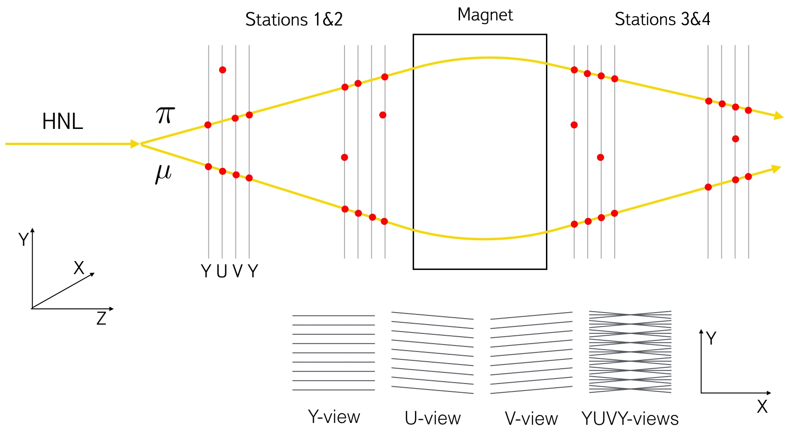
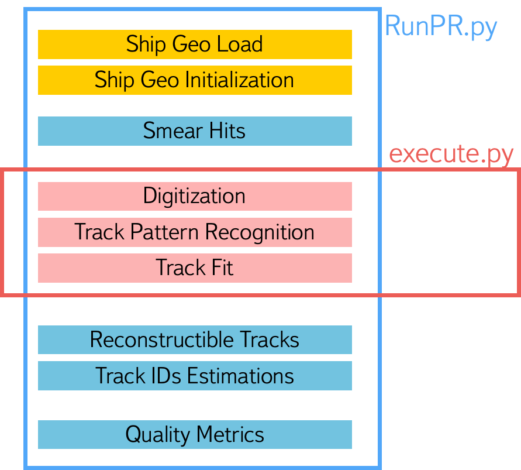

# Track Pattern Recognition


This direcroty contains all necessary scripts to run and test track patteern recognition methods. For this run the command: 
```bash
python RunPR.py -i ship.conical.Pythia8-TGeant4.root -g geofile_full.conical.Pythia8-TGeant4.root
```
Results of track pattern recognition will appear in `hists.root` file. 

## Code


#### `RunPR.py`
This script runs track pattern recognition with all additional steps: input data and SHiP geometry load, hits smearing, digitization, track pattern recognition, track fit, quality metric plots.

#### `execute.py`
The script contains function which performs pure track pattern recognition without any additional steps.

#### `models` directory
The directory contains scripts of all track pattern recognition methods: Hough Transform, Artificial Retina, ...

#### `pattern_recognition.py`
The file contains functions which use models from the `models` directory to perform SHiP track pattern recognition.

#### `fit.py`
This script contains functions needed to fit recognized tracks.

#### `mctruth.py`
Functions in this script allows to get MC truth data about hits and tracks.

#### `quality.py`
The file has functions to plot quality metrics of SHiP track pattern recognition.

## Requirements
```bash
numpy >= 1.12.1
scipy >= 0.19.0
scikit-learn >= 0.17.1
```
